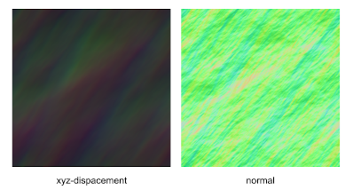

# Pre-computed FFT Water

Usually, GPU-based parallelization is necessary to perform a high resolution FFT water simulation.
However, by using pre-computed height maps, xz-displacement maps and normal maps,
even a high resolution simulation can be performed in realtime.
This is a trade-off between performance and memory use.

# License

The MIT License (MIT)

Copyright (c) 2021, Jiang Ye

Permission is hereby granted, free of charge, to any person obtaining a copy of this software and associated documentation files (the "Software"), to deal in the Software without restriction, including without limitation the rights to use, copy, modify, merge, publish, distribute, sublicense, and/or sell copies of the Software, and to permit persons to whom the Software is furnished to do so, subject to the following conditions:

The above copyright notice and this permission notice shall be included in all copies or substantial portions of the Software.

THE SOFTWARE IS PROVIDED "AS IS", WITHOUT WARRANTY OF ANY KIND, EXPRESS OR IMPLIED, INCLUDING BUT NOT LIMITED TO THE WARRANTIES OF MERCHANTABILITY, FITNESS FOR A PARTICULAR PURPOSE AND NONINFRINGEMENT. IN NO EVENT SHALL THE AUTHORS OR COPYRIGHT HOLDERS BE LIABLE FOR ANY CLAIM, DAMAGES OR OTHER LIABILITY, WHETHER IN AN ACTION OF CONTRACT, TORT OR OTHERWISE, ARISING FROM, OUT OF OR IN CONNECTION WITH THE SOFTWARE OR THE USE OR OTHER DEALINGS IN THE SOFTWARE.

# Method

Pre-compute a displacement map and a height map [1] for each frame using [fftWater](https://github.com/iamyoukou/fftWater).
I use the following algorithm to compute and save those maps:

    // similar for xz-displacement and normal map
    height <- (originalValue + offset) / scale * 255;
    (R, G, B) <- (xDisplacement, height, zDisplacement);

# Result

The result in the demo video is performed in realtime.

The pre-computed FFT water in the demo has a `512x512` resolution.
It uses a displacement map and a normal map for each frame.
Each type of maps has an amount of `5000`.
All the maps are stored in `png` format.
The total memory for storing those maps is about `3.2GB`.
